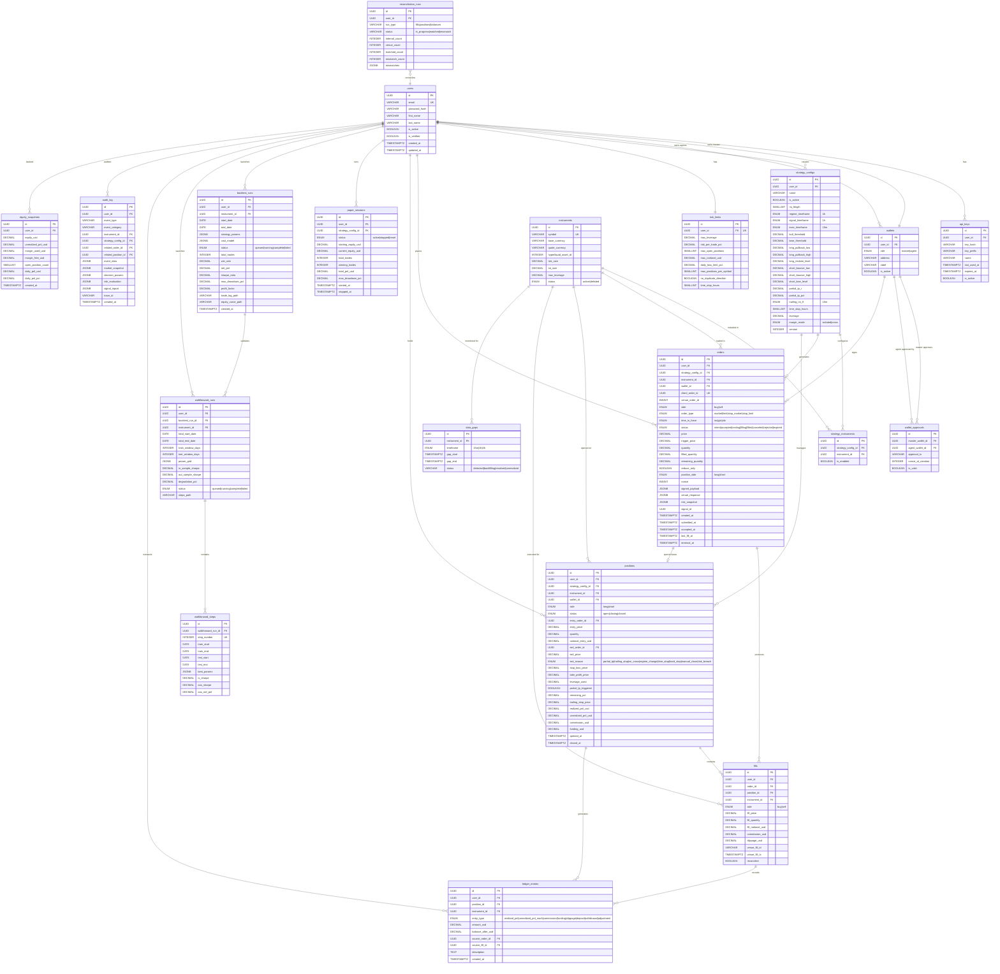

# Database Schema -- RSI Trading Bot on Hyperliquid

**Version:** 1.0.0
**Date:** 2026-04-28
**Status:** Design -- pre-implementation
**Databases:** PostgreSQL (config, state, audit), TimescaleDB (time-series), Redis (real-time cache)

---

## Table of Contents

1. [PostgreSQL Schema](#1-postgresql-schema)
2. [TimescaleDB Schema](#2-timescaledb-schema)
3. [Redis Key Structure](#3-redis-key-structure)
4. [ER Diagram](#4-er-diagram)
5. [Index Strategy](#5-index-strategy)
6. [Partitioning Strategy](#6-partitioning-strategy)

---

## 1. PostgreSQL Schema

### 1.1 Custom Types

```sql
-- Enumerations used across multiple tables

CREATE TYPE order_status AS ENUM (
    'intent',       -- Created internally, not yet sent to venue
    'accepted',     -- Venue acknowledged, waiting for fill
    'resting',      -- Limit order sitting in book
    'filling',      -- Partially filled
    'filled',       -- Fully filled
    'canceled',     -- Canceled before full fill
    'rejected',     -- Venue rejected the order
    'expired'       -- Time-in-force expired
);

CREATE TYPE order_side AS ENUM ('buy', 'sell');

CREATE TYPE order_type AS ENUM ('market', 'limit', 'stop_market', 'stop_limit');

CREATE TYPE time_in_force AS ENUM ('ioc', 'gtc', 'alo');

CREATE TYPE position_side AS ENUM ('long', 'short');

CREATE TYPE position_status AS ENUM ('open', 'closing', 'closed');

CREATE TYPE margin_mode AS ENUM ('isolated', 'cross');

CREATE TYPE regime AS ENUM ('bull', 'bear', 'neutral');

CREATE TYPE signal_state AS ENUM (
    'waiting',
    'pullback_detected',
    'entry_triggered',
    'confirmed',
    'no_signal'
);

CREATE TYPE direction AS ENUM ('long', 'short');

CREATE TYPE exit_reason AS ENUM (
    'partial_tp',       -- 50% closed at 1.5R
    'trailing_stop',    -- RSI 15m trailing exit
    'rsi_cross',        -- RSI 1h cross against position
    'regime_change',    -- 4h regime flipped or went neutral
    'time_stop',        -- Held beyond 36 hours
    'hard_stop',        -- Price hit stop-loss
    'manual_close',     -- User manually closed
    'risk_breach'       -- Risk limit triggered close
);

CREATE TYPE timeframe AS ENUM ('15m', '1h', '4h');

CREATE TYPE backtest_status AS ENUM ('queued', 'running', 'complete', 'failed');

CREATE TYPE session_status AS ENUM ('active', 'stopped', 'reset');

CREATE TYPE ledger_entry_type AS ENUM (
    'realized_pnl',
    'unrealized_pnl_mark',
    'commission',
    'funding',
    'slippage',
    'deposit',
    'withdrawal',
    'adjustment'
);

CREATE TYPE instrument_status AS ENUM ('active', 'delisted');

CREATE TYPE wallet_role AS ENUM ('master', 'agent');
```

### 1.2 Users and Authentication

```sql
CREATE TABLE users (
    id              UUID PRIMARY KEY DEFAULT gen_random_uuid(),
    email           VARCHAR(255) UNIQUE NOT NULL,
    password_hash   VARCHAR(255) NOT NULL,
    first_name      VARCHAR(100),
    last_name       VARCHAR(100),
    is_active       BOOLEAN DEFAULT true,
    is_verified     BOOLEAN DEFAULT false,
    created_at      TIMESTAMPTZ DEFAULT now(),
    updated_at      TIMESTAMPTZ DEFAULT now(),

    CONSTRAINT valid_email CHECK (email ~* '^[A-Za-z0-9._%+-]+@[A-Za-z0-9.-]+\.[A-Za-z]{2,}$')
);

CREATE TABLE api_keys (
    id              UUID PRIMARY KEY DEFAULT gen_random_uuid(),
    user_id         UUID NOT NULL REFERENCES users(id) ON DELETE CASCADE,
    key_hash        VARCHAR(255) NOT NULL,
    key_prefix      VARCHAR(8) NOT NULL,         -- First 8 chars for identification
    name            VARCHAR(100),
    last_used_at    TIMESTAMPTZ,
    expires_at      TIMESTAMPTZ,
    is_active       BOOLEAN DEFAULT true,
    created_at      TIMESTAMPTZ DEFAULT now()
);

CREATE INDEX idx_api_keys_user_id ON api_keys(user_id);
CREATE INDEX idx_api_keys_key_hash ON api_keys(key_hash) WHERE is_active = true;
```

### 1.3 Instruments

```sql
CREATE TABLE instruments (
    id              UUID PRIMARY KEY DEFAULT gen_random_uuid(),
    symbol          VARCHAR(20) UNIQUE NOT NULL,  -- e.g. 'BTC', 'ETH', 'SOL'
    base_currency   VARCHAR(10) NOT NULL,
    quote_currency  VARCHAR(10) NOT NULL DEFAULT 'USD',
    hyperliquid_asset_id INTEGER NOT NULL,         -- Hyperliquid's internal asset index
    tick_size       DECIMAL(20,10) NOT NULL,
    lot_size        DECIMAL(20,10) NOT NULL,
    max_leverage    DECIMAL(5,2) NOT NULL DEFAULT 3.0,
    status          instrument_status DEFAULT 'active',
    created_at      TIMESTAMPTZ DEFAULT now(),
    updated_at      TIMESTAMPTZ DEFAULT now()
);
```

### 1.4 Agent Wallets (Non-Custodial Model)

```sql
-- Master wallets belong to users (never used in hot path)
-- Agent wallets are approved by master wallet and used for signing

CREATE TABLE wallets (
    id              UUID PRIMARY KEY DEFAULT gen_random_uuid(),
    user_id         UUID NOT NULL REFERENCES users(id) ON DELETE CASCADE,
    role            wallet_role NOT NULL,
    address         VARCHAR(66) NOT NULL,          -- Ethereum address (0x...)
    label           VARCHAR(100),
    is_active       BOOLEAN DEFAULT true,
    created_at      TIMESTAMPTZ DEFAULT now(),
    deactivated_at  TIMESTAMPTZ,

    CONSTRAINT valid_address CHECK (address ~* '^0x[a-fA-F0-9]{40}$')
);

-- Each user has exactly one master wallet
CREATE UNIQUE INDEX idx_wallets_master_per_user
    ON wallets(user_id) WHERE role = 'master' AND is_active = true;

-- Agent wallets linked to a master
CREATE INDEX idx_wallets_user_active ON wallets(user_id, is_active);

-- Agent wallet approval records
CREATE TABLE wallet_approvals (
    id              UUID PRIMARY KEY DEFAULT gen_random_uuid(),
    master_wallet_id UUID NOT NULL REFERENCES wallets(id),
    agent_wallet_id UUID NOT NULL REFERENCES wallets(id),
    approval_tx     VARCHAR(128),                 -- On-chain approval tx hash
    nonce_at_creation INTEGER,                    -- Nonce state when approved
    is_valid        BOOLEAN DEFAULT true,
    created_at      TIMESTAMPTZ DEFAULT now(),
    revoked_at      TIMESTAMPTZ
);
```

### 1.5 Strategies and Configurations

```sql
-- A strategy config holds the full parameter set for one RSI instance

CREATE TABLE strategy_configs (
    id                  UUID PRIMARY KEY DEFAULT gen_random_uuid(),
    user_id             UUID NOT NULL REFERENCES users(id) ON DELETE CASCADE,
    name                VARCHAR(100) NOT NULL,
    is_active           BOOLEAN DEFAULT false,

    -- RSI parameters
    rsi_length          SMALLINT NOT NULL DEFAULT 14,
    regime_timeframe    timeframe NOT NULL DEFAULT '4h',
    signal_timeframe    timeframe NOT NULL DEFAULT '1h',
    exec_timeframe      timeframe NOT NULL DEFAULT '15m',
    bull_threshold      DECIMAL(5,2) NOT NULL DEFAULT 55.0,    -- RSI above = bull regime
    bear_threshold      DECIMAL(5,2) NOT NULL DEFAULT 45.0,    -- RSI below = bear regime
    long_pullback_low   DECIMAL(5,2) NOT NULL DEFAULT 40.0,    -- RSI zone low for long entry
    long_pullback_high  DECIMAL(5,2) NOT NULL DEFAULT 48.0,    -- RSI zone high for long entry
    long_reclaim_level  DECIMAL(5,2) NOT NULL DEFAULT 50.0,    -- RSI must reclaim this for long
    short_bounce_low    DECIMAL(5,2) NOT NULL DEFAULT 52.0,    -- RSI zone low for short entry
    short_bounce_high   DECIMAL(5,2) NOT NULL DEFAULT 60.0,    -- RSI zone high for short entry
    short_lose_level    DECIMAL(5,2) NOT NULL DEFAULT 50.0,    -- RSI must lose this for short

    -- Exit parameters
    partial_tp_r        DECIMAL(5,2) NOT NULL DEFAULT 1.5,     -- Partial exit at 1.5R
    partial_tp_pct      DECIMAL(5,2) NOT NULL DEFAULT 50.0,    -- Close 50% at partial TP
    trailing_rsi_tf     timeframe NOT NULL DEFAULT '15m',       -- Timeframe for trailing RSI
    time_stop_hours     SMALLINT NOT NULL DEFAULT 36,

    -- Execution parameters
    leverage            DECIMAL(5,2) NOT NULL DEFAULT 2.0,
    margin_mode         margin_mode NOT NULL DEFAULT 'isolated',
    fee_mode            VARCHAR(20) NOT NULL DEFAULT 'taker',   -- taker, maker, mixed
    slippage_bps        DECIMAL(5,2) NOT NULL DEFAULT 2.5,

    -- Versioning
    version             INTEGER NOT NULL DEFAULT 1,
    created_at          TIMESTAMPTZ DEFAULT now(),
    updated_at          TIMESTAMPTZ DEFAULT now(),

    CONSTRAINT valid_thresholds CHECK (bull_threshold > bear_threshold),
    CONSTRAINT valid_leverage CHECK (leverage > 0 AND leverage <= 3.0),
    CONSTRAINT valid_rsi_params CHECK (rsi_length > 0 AND rsi_length <= 100)
);

CREATE INDEX idx_strategy_configs_user ON strategy_configs(user_id);
CREATE INDEX idx_strategy_configs_active ON strategy_configs(user_id) WHERE is_active = true;

-- Link strategy to specific instruments (one strategy can trade multiple symbols)
CREATE TABLE strategy_instruments (
    id                  UUID PRIMARY KEY DEFAULT gen_random_uuid(),
    strategy_config_id  UUID NOT NULL REFERENCES strategy_configs(id) ON DELETE CASCADE,
    instrument_id       UUID NOT NULL REFERENCES instruments(id) ON DELETE CASCADE,
    is_enabled          BOOLEAN DEFAULT true,
    created_at          TIMESTAMPTZ DEFAULT now(),

    UNIQUE(strategy_config_id, instrument_id)
);
```

### 1.6 Risk Limits

```sql
-- Per-user risk parameters, evaluated by the risk engine before every order

CREATE TABLE risk_limits (
    id                  UUID PRIMARY KEY DEFAULT gen_random_uuid(),
    user_id             UUID UNIQUE NOT NULL REFERENCES users(id) ON DELETE CASCADE,
    max_leverage        DECIMAL(5,2) NOT NULL DEFAULT 3.0,
    risk_per_trade_pct  DECIMAL(5,4) NOT NULL DEFAULT 0.005,   -- 0.5% of equity per trade
    max_open_positions  SMALLINT NOT NULL DEFAULT 3,
    max_notional_usd    DECIMAL(12,2),                          -- Max total notional exposure
    daily_loss_limit_pct DECIMAL(5,4) NOT NULL DEFAULT 0.02,   -- 2% daily loss limit
    max_positions_per_symbol SMALLINT NOT NULL DEFAULT 1,
    no_duplicate_direction BOOLEAN DEFAULT true,                -- No same-direction on same symbol
    time_stop_hours     SMALLINT NOT NULL DEFAULT 36,
    updated_at          TIMESTAMPTZ DEFAULT now(),

    CONSTRAINT valid_risk_pct CHECK (risk_per_trade_pct > 0 AND risk_per_trade_pct <= 0.1),
    CONSTRAINT valid_daily_loss CHECK (daily_loss_limit_pct > 0 AND daily_loss_limit_pct <= 0.1),
    CONSTRAINT valid_max_positions CHECK (max_open_positions > 0 AND max_open_positions <= 20)
);
```

### 1.7 Orders (OMS)

```sql
-- Full order lifecycle: intent -> accepted -> resting/filling -> terminal

CREATE TABLE orders (
    id                  UUID PRIMARY KEY DEFAULT gen_random_uuid(),
    user_id             UUID NOT NULL REFERENCES users(id),
    strategy_config_id  UUID REFERENCES strategy_configs(id),
    instrument_id       UUID NOT NULL REFERENCES instruments(id),
    wallet_id           UUID NOT NULL REFERENCES wallets(id),   -- Agent wallet used

    -- Order identification
    client_order_id     UUID NOT NULL UNIQUE,                   -- Internal correlation ID
    venue_order_id      BIGINT,                                 -- Hyperliquid order ID (oid)

    -- Order details
    side                order_side NOT NULL,
    order_type          order_type NOT NULL,
    time_in_force       time_in_force DEFAULT 'gtc',
    status              order_status NOT NULL DEFAULT 'intent',

    -- Price and size
    price               DECIMAL(20,8),                          -- Limit price (null for market)
    trigger_price       DECIMAL(20,8),                          -- Stop trigger price
    quantity             DECIMAL(20,8) NOT NULL,
    filled_quantity      DECIMAL(20,8) NOT NULL DEFAULT 0,
    remaining_quantity   DECIMAL(20,8) GENERATED ALWAYS AS (quantity - filled_quantity) STORED,

    -- Context
    reduce_only         BOOLEAN DEFAULT false,
    position_side       position_side NOT NULL,                 -- Which side of position this affects

    -- Venue interaction
    nonce               BIGINT,                                 -- Hyperliquid nonce used
    signed_payload      JSONB,                                  -- Full signed action sent
    venue_response      JSONB,                                  -- Raw venue response
    reject_reason       TEXT,

    -- Risk context at time of order
    risk_snapshot        JSONB,                                  -- Equity, open positions, daily PnL

    -- Signal context
    signal_id           UUID,                                   -- Link to the signal that generated this
    signal_rsi_4h       DECIMAL(7,4),
    signal_rsi_1h       DECIMAL(7,4),
    signal_rsi_15m      DECIMAL(7,4),
    signal_regime       regime,
    signal_state        signal_state,

    -- Execution context
    slippage_bps        DECIMAL(8,4),                           -- Actual slippage vs expected
    commission_usd      DECIMAL(12,4),

    -- Timestamps
    created_at          TIMESTAMPTZ NOT NULL DEFAULT now(),
    submitted_at        TIMESTAMPTZ,
    accepted_at         TIMESTAMPTZ,
    last_fill_at        TIMESTAMPTZ,
    terminal_at         TIMESTAMPTZ,

    CONSTRAINT valid_quantity CHECK (quantity > 0),
    CONSTRAINT valid_filled CHECK (filled_quantity >= 0 AND filled_quantity <= quantity),
    CONSTRAINT valid_price_for_limit CHECK (order_type != 'limit' OR price IS NOT NULL),
    CONSTRAINT valid_trigger_for_stop CHECK (
        (order_type IN ('stop_market', 'stop_limit') AND trigger_price IS NOT NULL) OR
        (order_type NOT IN ('stop_market', 'stop_limit'))
    )
);

-- Hot query: find active orders for a user
CREATE INDEX idx_orders_user_status ON orders(user_id, status)
    WHERE status NOT IN ('filled', 'canceled', 'rejected', 'expired');

-- Reconciliation: look up by venue order ID
CREATE INDEX idx_orders_venue_oid ON orders(venue_order_id)
    WHERE venue_order_id IS NOT NULL;

-- Client order ID lookup (for cancel/replace)
CREATE INDEX idx_orders_client_oid ON orders(client_order_id);

-- Strategy audit trail
CREATE INDEX idx_orders_strategy ON orders(strategy_config_id, created_at DESC);

-- Nonce tracking (prevent reuse)
CREATE INDEX idx_orders_wallet_nonce ON orders(wallet_id, nonce)
    WHERE nonce IS NOT NULL;

-- Terminal orders partition pruning
CREATE INDEX idx_orders_terminal ON orders(user_id, terminal_at DESC)
    WHERE terminal_at IS NOT NULL;
```

### 1.8 Positions

```sql
CREATE TABLE positions (
    id                  UUID PRIMARY KEY DEFAULT gen_random_uuid(),
    user_id             UUID NOT NULL REFERENCES users(id),
    strategy_config_id  UUID REFERENCES strategy_configs(id),
    instrument_id       UUID NOT NULL REFERENCES instruments(id),
    wallet_id           UUID NOT NULL REFERENCES wallets(id),

    side                position_side NOT NULL,
    status              position_status NOT NULL DEFAULT 'open',

    -- Entry
    entry_order_id      UUID REFERENCES orders(id),
    entry_price         DECIMAL(20,8) NOT NULL,
    quantity             DECIMAL(20,8) NOT NULL,
    notional_entry_usd  DECIMAL(20,8) NOT NULL,    -- entry_price * quantity

    -- Exit tracking
    exit_order_id       UUID REFERENCES orders(id),
    exit_price          DECIMAL(20,8),
    exit_reason         exit_reason,

    -- Risk parameters at open
    stop_loss_price     DECIMAL(20,8) NOT NULL,
    take_profit_price   DECIMAL(20,8),
    risk_distance_usd   DECIMAL(20,8) NOT NULL,    -- Distance to stop in USD
    risk_reward_ratio   DECIMAL(8,4),               -- Planned R:R
    leverage_used       DECIMAL(5,2) NOT NULL,

    -- Partial exit tracking
    partial_tp_triggered BOOLEAN DEFAULT false,
    partial_tp_price     DECIMAL(20,8),
    remaining_pct        DECIMAL(5,2) DEFAULT 100.0, -- % of original position remaining
    trailing_stop_price  DECIMAL(20,8),              -- Moves after partial TP

    -- PnL
    realized_pnl_usd    DECIMAL(12,4) DEFAULT 0,
    unrealized_pnl_usd  DECIMAL(12,4),               -- Snapshot at last mark
    commission_usd      DECIMAL(12,4) DEFAULT 0,
    funding_usd         DECIMAL(12,4) DEFAULT 0,

    -- Reconciliation
    venue_entry_fill_id VARCHAR(128),                 -- Hyperliquid fill ID for entry
    venue_exit_fill_id  VARCHAR(128),                 -- Hyperliquid fill ID for exit

    -- Timestamps
    opened_at           TIMESTAMPTZ NOT NULL DEFAULT now(),
    partial_tp_at       TIMESTAMPTZ,
    closed_at           TIMESTAMPTZ,

    CONSTRAINT valid_quantity CHECK (quantity > 0),
    CONSTRAINT valid_leverage CHECK (leverage_used > 0 AND leverage_used <= 3.0),
    CONSTRAINT valid_remaining_pct CHECK (remaining_pct > 0 AND remaining_pct <= 100)
);

-- Active positions per user (hot query)
CREATE INDEX idx_positions_user_open ON positions(user_id, instrument_id)
    WHERE status = 'open';

-- Closed positions for reporting
CREATE INDEX idx_positions_closed ON positions(user_id, closed_at DESC)
    WHERE status = 'closed';

-- Strategy performance analysis
CREATE INDEX idx_positions_strategy ON positions(strategy_config_id, opened_at DESC)
    WHERE strategy_config_id IS NOT NULL;
```

### 1.9 Fills

```sql
-- Individual fill events, both from venue and internal

CREATE TABLE fills (
    id                  UUID PRIMARY KEY DEFAULT gen_random_uuid(),
    user_id             UUID NOT NULL REFERENCES users(id),
    order_id            UUID NOT NULL REFERENCES orders(id),
    position_id         UUID REFERENCES positions(id),
    instrument_id       UUID NOT NULL REFERENCES instruments(id),

    -- Fill details
    side                order_side NOT NULL,
    fill_price          DECIMAL(20,8) NOT NULL,
    fill_quantity        DECIMAL(20,8) NOT NULL,
    fill_notional_usd   DECIMAL(20,8) NOT NULL,

    -- Costs
    commission_usd      DECIMAL(12,4) NOT NULL DEFAULT 0,
    slippage_usd        DECIMAL(12,4),

    -- Venue correlation
    venue_fill_id       VARCHAR(128),
    venue_fill_ts       TIMESTAMPTZ,

    -- Reconciliation
    reconciled          BOOLEAN DEFAULT false,
    reconciled_at       TIMESTAMPTZ,
    reconciliation_diff DECIMAL(20,8),               -- Difference vs venue fill

    created_at          TIMESTAMPTZ NOT NULL DEFAULT now(),

    CONSTRAINT valid_fill_price CHECK (fill_price > 0),
    CONSTRAINT valid_fill_qty CHECK (fill_quantity > 0)
);

-- Order fills lookup
CREATE INDEX idx_fills_order ON fills(order_id, created_at);

-- Position fills lookup
CREATE INDEX idx_fills_position ON fills(position_id)
    WHERE position_id IS NOT NULL;

-- Reconciliation queries
CREATE INDEX idx_fills_unreconciled ON fills(user_id, created_at DESC)
    WHERE reconciled = false;

-- Venue fill ID for reconciliation
CREATE INDEX idx_fills_venue_fill ON fills(venue_fill_id)
    WHERE venue_fill_id IS NOT NULL;
```

### 1.10 Ledger Entries (PnL and Account Tracking)

```sql
-- Double-entry ledger for all financial movements

CREATE TABLE ledger_entries (
    id                  UUID PRIMARY KEY DEFAULT gen_random_uuid(),
    user_id             UUID NOT NULL REFERENCES users(id),
    position_id         UUID REFERENCES positions(id),
    instrument_id       UUID REFERENCES instruments(id),

    entry_type          ledger_entry_type NOT NULL,
    amount_usd          DECIMAL(12,4) NOT NULL,              -- Positive = credit, negative = debit
    balance_after_usd   DECIMAL(12,4) NOT NULL,              -- Running balance after this entry

    -- Reference to source
    source_order_id     UUID REFERENCES orders(id),
    source_fill_id      UUID REFERENCES fills(id),

    description         TEXT,

    created_at          TIMESTAMPTZ NOT NULL DEFAULT now()
);

-- User balance history
CREATE INDEX idx_ledger_user_balance ON ledger_entries(user_id, created_at DESC);

-- Position PnL breakdown
CREATE INDEX idx_ledger_position ON ledger_entries(position_id, entry_type)
    WHERE position_id IS NOT NULL;

-- Daily PnL aggregation
CREATE INDEX idx_ledger_daily_pnl ON ledger_entries(user_id, entry_type, created_at DESC)
    WHERE entry_type IN ('realized_pnl', 'commission', 'funding', 'slippage');
```

### 1.11 Equity Snapshots (PostgreSQL copy for recent state)

```sql
-- Periodic equity snapshots stored in PostgreSQL for quick dashboard access
-- Full historical series stored in TimescaleDB

CREATE TABLE equity_snapshots (
    id                  UUID PRIMARY KEY DEFAULT gen_random_uuid(),
    user_id             UUID NOT NULL REFERENCES users(id),
    equity_usd          DECIMAL(12,4) NOT NULL,
    unrealized_pnl_usd  DECIMAL(12,4) NOT NULL DEFAULT 0,
    margin_used_usd     DECIMAL(12,4) NOT NULL DEFAULT 0,
    margin_free_usd     DECIMAL(12,4) NOT NULL DEFAULT 0,
    open_position_count SMALLINT NOT NULL DEFAULT 0,
    daily_pnl_usd       DECIMAL(12,4) NOT NULL DEFAULT 0,
    daily_pnl_pct       DECIMAL(8,6) NOT NULL DEFAULT 0,
    created_at          TIMESTAMPTZ NOT NULL DEFAULT now()
);

CREATE INDEX idx_equity_user_latest ON equity_snapshots(user_id, created_at DESC);
```

### 1.12 Audit Log

```sql
-- Immutable audit trail for every trading decision

CREATE TABLE audit_log (
    id                  UUID PRIMARY KEY DEFAULT gen_random_uuid(),
    user_id             UUID NOT NULL REFERENCES users(id),

    -- What happened
    event_type          VARCHAR(50) NOT NULL,       -- e.g. 'signal.generated', 'order.submitted'
    event_category      VARCHAR(30) NOT NULL,       -- 'signal', 'risk', 'execution', 'reconciliation'

    -- Context
    instrument_id       UUID REFERENCES instruments(id),
    strategy_config_id  UUID REFERENCES strategy_configs(id),
    related_order_id    UUID REFERENCES orders(id),
    related_position_id UUID REFERENCES positions(id),

    -- Full state snapshot for reconstruction
    event_data          JSONB NOT NULL,              -- Full event payload

    -- Market state at time of event
    market_snapshot     JSONB,                       -- Prices, RSI values, regime at event time

    -- Decision trail
    decision_params     JSONB,                       -- Strategy params used for this decision
    risk_evaluation     JSONB,                       -- Risk engine output
    signal_inputs       JSONB,                       -- Raw inputs to signal generator

    -- Request tracing
    trace_id            VARCHAR(64),
    span_id             VARCHAR(64),

    -- Immutability
    created_at          TIMESTAMPTZ NOT NULL DEFAULT now(),

    -- Prevent updates and deletes
    CONSTRAINT no_future_timestamp CHECK (created_at <= now() + interval '1 second')
);

-- Revoke modification permissions (application-enforced; also use DB role restrictions)
-- CREATE RULE audit_no_update AS ON UPDATE TO audit_log DO INSTEAD NOTHING;
-- CREATE RULE audit_no_delete AS ON DELETE TO audit_log DO INSTEAD NOTHING;

-- Query by user and time range
CREATE INDEX idx_audit_user_time ON audit_log(user_id, created_at DESC);

-- Query by event type
CREATE INDEX idx_audit_event_type ON audit_log(event_type, created_at DESC);

-- Query by instrument for strategy analysis
CREATE INDEX idx_audit_instrument ON audit_log(instrument_id, created_at DESC)
    WHERE instrument_id IS NOT NULL;

-- Trace ID lookup for debugging
CREATE INDEX idx_audit_trace ON audit_log(trace_id)
    WHERE trace_id IS NOT NULL;
```

### 1.13 Paper Trading Sessions

```sql
CREATE TABLE paper_sessions (
    id                  UUID PRIMARY KEY DEFAULT gen_random_uuid(),
    user_id             UUID NOT NULL REFERENCES users(id) ON DELETE CASCADE,
    strategy_config_id  UUID REFERENCES strategy_configs(id),
    status              session_status NOT NULL DEFAULT 'active',
    starting_equity_usd DECIMAL(12,4) NOT NULL DEFAULT 10000.0,
    current_equity_usd  DECIMAL(12,4) NOT NULL DEFAULT 10000.0,
    total_trades        INTEGER NOT NULL DEFAULT 0,
    winning_trades      INTEGER NOT NULL DEFAULT 0,
    total_pnl_usd       DECIMAL(12,4) NOT NULL DEFAULT 0,
    max_drawdown_pct    DECIMAL(8,4) NOT NULL DEFAULT 0,
    started_at          TIMESTAMPTZ NOT NULL DEFAULT now(),
    stopped_at          TIMESTAMPTZ,
    reset_at            TIMESTAMPTZ
);

CREATE INDEX idx_paper_sessions_user ON paper_sessions(user_id, started_at DESC);
CREATE INDEX idx_paper_sessions_active ON paper_sessions(user_id)
    WHERE status = 'active';
```

### 1.14 Backtest Configurations and Results

```sql
CREATE TABLE backtest_runs (
    id                  UUID PRIMARY KEY DEFAULT gen_random_uuid(),
    user_id             UUID NOT NULL REFERENCES users(id) ON DELETE CASCADE,

    -- Scope
    instrument_id       UUID NOT NULL REFERENCES instruments(id),
    start_date          DATE NOT NULL,
    end_date            DATE NOT NULL,

    -- Strategy parameters (snapshot, not FK -- backtests must be reproducible)
    strategy_params     JSONB NOT NULL,              -- Full parameter set used

    -- Cost model
    cost_model          JSONB NOT NULL,              -- {fee_mode, slippage_bps, funding_mode}

    -- Status
    status              backtest_status NOT NULL DEFAULT 'queued',
    error_message       TEXT,
    started_at          TIMESTAMPTZ,
    completed_at        TIMESTAMPTZ,

    -- Aggregate metrics (populated on completion)
    total_trades        INTEGER,
    winning_trades      INTEGER,
    losing_trades       INTEGER,
    win_rate            DECIMAL(5,4),
    gross_profit        DECIMAL(14,4),
    gross_loss          DECIMAL(14,4),
    net_pnl             DECIMAL(14,4),
    expectancy_per_trade DECIMAL(10,6),
    profit_factor       DECIMAL(10,4),
    cagr                DECIMAL(8,6),
    sharpe_ratio        DECIMAL(8,4),
    max_drawdown_pct    DECIMAL(8,4),
    avg_win_usd         DECIMAL(12,4),
    avg_loss_usd        DECIMAL(12,4),
    avg_holding_hours   DECIMAL(8,2),
    trades_per_year     DECIMAL(8,1),
    total_commission    DECIMAL(12,4),
    total_slippage      DECIMAL(12,4),
    total_funding       DECIMAL(12,4),

    -- Storage references
    trade_log_path      VARCHAR(500),                -- MinIO path to trade log Parquet
    equity_curve_path   VARCHAR(500),                -- MinIO path to equity curve Parquet

    created_at          TIMESTAMPTZ NOT NULL DEFAULT now(),

    CONSTRAINT valid_date_range CHECK (end_date > start_date),
    CONSTRAINT valid_win_rate CHECK (win_rate IS NULL OR (win_rate >= 0 AND win_rate <= 1))
);

CREATE INDEX idx_backtest_user ON backtest_runs(user_id, created_at DESC);
CREATE INDEX idx_backtest_instrument ON backtest_runs(instrument_id, start_date, end_date);
CREATE INDEX idx_backtest_status ON backtest_runs(status)
    WHERE status IN ('queued', 'running');
```

### 1.15 Walk-Forward Validation Results

```sql
-- Each walk-forward step: train window optimization + test window result

CREATE TABLE walkforward_runs (
    id                  UUID PRIMARY KEY DEFAULT gen_random_uuid(),
    user_id             UUID NOT NULL REFERENCES users(id) ON DELETE CASCADE,
    backtest_run_id     UUID REFERENCES backtest_runs(id) ON DELETE CASCADE,
    instrument_id       UUID NOT NULL REFERENCES instruments(id),

    -- Walk-forward configuration
    total_start_date    DATE NOT NULL,
    total_end_date      DATE NOT NULL,
    train_window_days   INTEGER NOT NULL,
    test_window_days    INTEGER NOT NULL,
    param_grid          JSONB NOT NULL,              -- Parameter combinations tested

    -- Aggregate walk-forward metrics
    in_sample_sharpe    DECIMAL(8,4),
    out_sample_sharpe   DECIMAL(8,4),
    degradation_pct     DECIMAL(8,4),                -- (IS - OOS) / IS
    total_oos_trades    INTEGER,
    oos_net_pnl         DECIMAL(14,4),
    oos_max_drawdown    DECIMAL(8,4),

    status              backtest_status NOT NULL DEFAULT 'queued',
    error_message       TEXT,
    steps_path          VARCHAR(500),                 -- MinIO path to per-step results

    started_at          TIMESTAMPTZ,
    completed_at        TIMESTAMPTZ,
    created_at          TIMESTAMPTZ NOT NULL DEFAULT now(),

    CONSTRAINT valid_windows CHECK (train_window_days > 0 AND test_window_days > 0)
);

-- Individual steps within a walk-forward run
CREATE TABLE walkforward_steps (
    id                  UUID PRIMARY KEY DEFAULT gen_random_uuid(),
    walkforward_run_id  UUID NOT NULL REFERENCES walkforward_runs(id) ON DELETE CASCADE,

    step_number         INTEGER NOT NULL,
    train_start         DATE NOT NULL,
    train_end           DATE NOT NULL,
    test_start          DATE NOT NULL,
    test_end            DATE NOT NULL,

    -- Best parameters found in training
    best_params         JSONB NOT NULL,

    -- In-sample metrics (training window)
    is_sharpe           DECIMAL(8,4),
    is_total_trades     INTEGER,
    is_net_pnl          DECIMAL(14,4),
    is_max_drawdown     DECIMAL(8,4),

    -- Out-of-sample metrics (test window, frozen params)
    oos_sharpe          DECIMAL(8,4),
    oos_total_trades    INTEGER,
    oos_net_pnl         DECIMAL(14,4),
    oos_max_drawdown    DECIMAL(8,4),
    oos_win_rate        DECIMAL(5,4),

    created_at          TIMESTAMPTZ NOT NULL DEFAULT now(),

    UNIQUE(walkforward_run_id, step_number)
);

CREATE INDEX idx_walkforward_user ON walkforward_runs(user_id, created_at DESC);
CREATE INDEX idx_walkforward_steps_run ON walkforward_steps(walkforward_run_id, step_number);
```

### 1.16 Reconciliation Records

```sql
-- Track reconciliation runs between internal ledger and Hyperliquid state

CREATE TABLE reconciliation_runs (
    id                  UUID PRIMARY KEY DEFAULT gen_random_uuid(),
    user_id             UUID NOT NULL REFERENCES users(id),

    run_type            VARCHAR(20) NOT NULL,        -- 'fills', 'positions', 'balances'
    status              VARCHAR(20) NOT NULL,         -- 'in_progress', 'matched', 'mismatch'

    -- Summary
    internal_count      INTEGER,
    venue_count         INTEGER,
    matched_count       INTEGER,
    mismatch_count      INTEGER NOT NULL DEFAULT 0,

    -- Details of mismatches
    mismatches          JSONB,                        -- Array of mismatch details

    started_at          TIMESTAMPTZ NOT NULL DEFAULT now(),
    completed_at        TIMESTAMPTZ,

    CONSTRAINT valid_run_type CHECK (run_type IN ('fills', 'positions', 'balances'))
);

CREATE INDEX idx_reconciliation_user ON reconciliation_runs(user_id, started_at DESC);
CREATE INDEX idx_reconciliation_mismatch ON reconciliation_runs(user_id)
    WHERE mismatch_count > 0;
```

### 1.17 Data Gaps

```sql
-- Track detected gaps in market data for backfill

CREATE TABLE data_gaps (
    id                  UUID PRIMARY KEY DEFAULT gen_random_uuid(),
    instrument_id       UUID NOT NULL REFERENCES instruments(id),
    timeframe           timeframe NOT NULL,
    gap_start           TIMESTAMPTZ NOT NULL,
    gap_end             TIMESTAMPTZ NOT NULL,
    status              VARCHAR(20) NOT NULL DEFAULT 'detected',  -- detected, backfilling, resolved, unresolved
    backfill_attempt_count INTEGER DEFAULT 0,
    resolved_at         TIMESTAMPTZ,
    created_at          TIMESTAMPTZ NOT NULL DEFAULT now(),

    CONSTRAINT valid_gap_range CHECK (gap_end > gap_start)
);

CREATE INDEX idx_data_gaps_unresolved ON data_gaps(instrument_id, timeframe, status)
    WHERE status IN ('detected', 'backfilling');
```

---

## 2. TimescaleDB Schema

All hypertables use TimescaleDB extension. Enable with:

```sql
CREATE EXTENSION IF NOT EXISTS timescaledb;
```

### 2.1 Candle Data (OHLCV)

```sql
CREATE TABLE candles (
    time                TIMESTAMPTZ NOT NULL,
    instrument_id       UUID NOT NULL,
    timeframe           timeframe NOT NULL,
    open                DECIMAL(20,8) NOT NULL,
    high                DECIMAL(20,8) NOT NULL,
    low                 DECIMAL(20,8) NOT NULL,
    close               DECIMAL(20,8) NOT NULL,
    volume              DECIMAL(20,8) NOT NULL,

    -- Data lineage
    source              VARCHAR(20) NOT NULL DEFAULT 'websocket',  -- websocket, rest_backfill, parquet_import

    created_at          TIMESTAMPTZ NOT NULL DEFAULT now(),

    CONSTRAINT valid_ohlcv CHECK (
        high >= low AND
        high >= open AND high >= close AND
        low <= open AND low <= close AND
        volume >= 0
    ),
    UNIQUE(time, instrument_id, timeframe)
);

SELECT create_hypertable('candles', 'time',
    chunk_time_interval => interval '1 week',
    partitioning_column => 'instrument_id',
    number_partitions => 3
);

-- Primary query: candles for a symbol+timeframe in a time range
CREATE INDEX idx_candles_lookup ON candles(instrument_id, timeframe, time DESC);

-- Gap detection: find missing bars
CREATE INDEX idx_candles_time_seq ON candles(instrument_id, timeframe, time ASC);
```

### 2.2 RSI Indicator Values

```sql
-- Pre-computed RSI values per market and timeframe, updated on each candle close

CREATE TABLE rsi_values (
    time                TIMESTAMPTZ NOT NULL,
    instrument_id       UUID NOT NULL,
    timeframe           timeframe NOT NULL,
    rsi_length          SMALLINT NOT NULL DEFAULT 14,
    rsi_value           DECIMAL(8,4) NOT NULL,

    -- Intermediate values for incremental calculation
    avg_gain            DECIMAL(20,10),
    avg_loss            DECIMAL(20,10),

    created_at          TIMESTAMPTZ NOT NULL DEFAULT now(),

    CONSTRAINT valid_rsi CHECK (rsi_value >= 0 AND rsi_value <= 100),
    UNIQUE(time, instrument_id, timeframe, rsi_length)
);

SELECT create_hypertable('rsi_values', 'time',
    chunk_time_interval => interval '1 month',
    partitioning_column => 'instrument_id',
    number_partitions => 3
);

CREATE INDEX idx_rsi_lookup ON rsi_values(instrument_id, timeframe, rsi_length, time DESC);
```

### 2.3 Signal Events

```sql
-- Every signal state transition emitted by the RSI engine

CREATE TABLE signal_events (
    time                TIMESTAMPTZ NOT NULL,
    user_id             UUID,
    instrument_id       UUID NOT NULL,
    strategy_config_id  UUID,

    -- Signal classification
    regime              regime NOT NULL,
    signal_state        signal_state NOT NULL,
    direction           direction,

    -- RSI inputs that produced this signal
    rsi_4h              DECIMAL(7,4),
    rsi_1h              DECIMAL(7,4),
    rsi_15m             DECIMAL(7,4),

    -- Price at signal time
    mark_price          DECIMAL(20,8),

    -- Whether this signal was acted on
    order_submitted     BOOLEAN DEFAULT false,

    created_at          TIMESTAMPTZ NOT NULL DEFAULT now()
);

SELECT create_hypertable('signal_events', 'time',
    chunk_time_interval => interval '1 month',
    partitioning_column => 'instrument_id',
    number_partitions => 3
);

CREATE INDEX idx_signals_instrument_time ON signal_events(instrument_id, time DESC);
CREATE INDEX idx_signals_user_time ON signal_events(user_id, time DESC)
    WHERE user_id IS NOT NULL;
CREATE INDEX idx_signals_triggered ON signal_events(instrument_id, signal_state, time DESC)
    WHERE signal_state = 'confirmed';
```

### 2.4 Funding Rates

```sql
CREATE TABLE funding_rates (
    time                TIMESTAMPTZ NOT NULL,
    instrument_id       UUID NOT NULL,
    funding_rate        DECIMAL(12,10) NOT NULL,       -- e.g. 0.0001 = 0.01%
    funding_rate_annual DECIMAL(8,4),                  -- Annualized for convenience
    mark_price          DECIMAL(20,8) NOT NULL,
    index_price         DECIMAL(20,8),

    created_at          TIMESTAMPTZ NOT NULL DEFAULT now(),

    UNIQUE(time, instrument_id)
);

SELECT create_hypertable('funding_rates', 'time',
    chunk_time_interval => interval '3 months'
);

CREATE INDEX idx_funding_instrument ON funding_rates(instrument_id, time DESC);
```

### 2.5 Equity Time Series

```sql
-- High-resolution equity curve for reporting and risk monitoring

CREATE TABLE equity_ts (
    time                TIMESTAMPTZ NOT NULL,
    user_id             UUID NOT NULL,
    equity_usd          DECIMAL(12,4) NOT NULL,
    unrealized_pnl_usd  DECIMAL(12,4) NOT NULL DEFAULT 0,
    margin_used_usd     DECIMAL(12,4) NOT NULL DEFAULT 0,
    open_positions      SMALLINT NOT NULL DEFAULT 0,
    daily_pnl_usd       DECIMAL(12,4) NOT NULL DEFAULT 0,

    created_at          TIMESTAMPTZ NOT NULL DEFAULT now()
);

SELECT create_hypertable('equity_ts', 'time',
    chunk_time_interval => interval '1 month',
    partitioning_column => 'user_id',
    number_partitions => 4
);

CREATE INDEX idx_equity_ts_user ON equity_ts(user_id, time DESC);
```

### 2.6 Fill Metrics and Slippage

```sql
-- Detailed per-fill analytics for execution quality monitoring

CREATE TABLE fill_metrics (
    time                TIMESTAMPTZ NOT NULL,
    user_id             UUID NOT NULL,
    fill_id             UUID NOT NULL,                -- FK to PostgreSQL fills table
    instrument_id       UUID NOT NULL,

    -- Execution quality
    expected_price      DECIMAL(20,8) NOT NULL,       -- Signal price or mid at order time
    actual_price        DECIMAL(20,8) NOT NULL,
    slippage_bps        DECIMAL(8,4) NOT NULL,        -- (actual - expected) / expected * 10000
    slippage_usd        DECIMAL(12,4) NOT NULL,

    -- Market conditions at fill time
    bid_at_fill         DECIMAL(20,8),
    ask_at_fill         DECIMAL(20,8),
    spread_bps          DECIMAL(8,4),
    book_depth_usd      DECIMAL(14,4),

    -- Cost breakdown
    commission_usd      DECIMAL(12,4) NOT NULL,
    total_cost_usd      DECIMAL(12,4) NOT NULL,       -- commission + slippage

    created_at          TIMESTAMPTZ NOT NULL DEFAULT now()
);

SELECT create_hypertable('fill_metrics', 'time',
    chunk_time_interval => interval '1 month',
    partitioning_column => 'user_id',
    number_partitions => 4
);

CREATE INDEX idx_fill_metrics_user ON fill_metrics(user_id, time DESC);
CREATE INDEX idx_fill_metrics_instrument ON fill_metrics(instrument_id, time DESC);
```

### 2.7 Latency Metrics

```sql
-- End-to-end and segment latency tracking

CREATE TABLE latency_metrics (
    time                TIMESTAMPTZ NOT NULL,
    user_id             UUID,

    -- Segment latencies in milliseconds
    ws_to_signal_ms     INTEGER,                      -- WebSocket receipt to signal generation
    signal_to_risk_ms   INTEGER,                      -- Signal to risk engine decision
    risk_to_oms_ms      INTEGER,                      -- Risk approval to OMS submission
    oms_to_signed_ms    INTEGER,                      -- OMS to signed payload
    signed_to_venue_ms  INTEGER,                      -- Signed payload to venue ack
    venue_to_fill_ms    INTEGER,                      -- Venue ack to first fill
    total_e2e_ms        INTEGER,                      -- End-to-end: candle close to fill

    -- Context
    instrument_id       UUID,
    order_type          VARCHAR(20),

    created_at          TIMESTAMPTZ NOT NULL DEFAULT now()
);

SELECT create_hypertable('latency_metrics', 'time',
    chunk_time_interval => interval '1 month'
);

CREATE INDEX idx_latency_time ON latency_metrics(time DESC);
CREATE INDEX idx_latency_e2e ON latency_metrics(total_e2e_ms DESC)
    WHERE total_e2e_ms IS NOT NULL;
```

### 2.8 Continuous Aggregates for Dashboard

```sql
-- Hourly equity summary for fast dashboard queries
CREATE MATERIALIZED VIEW equity_hourly
WITH (timescaledb.continuous) AS
SELECT
    time_bucket('1 hour', time) AS bucket,
    user_id,
    last(equity_usd, time) AS equity_close,
    min(equity_usd) AS equity_low,
    max(equity_usd) AS equity_high,
    last(unrealized_pnl_usd, time) AS unrealized_pnl,
    last(open_positions, time) AS position_count,
    sum(daily_pnl_usd) AS hourly_pnl
FROM equity_ts
GROUP BY bucket, user_id
WITH NO DATA;

-- Daily fill quality summary
CREATE MATERIALIZED VIEW fill_quality_daily
WITH (timescaledb.continuous) AS
SELECT
    time_bucket('1 day', time) AS bucket,
    user_id,
    instrument_id,
    count(*) AS fill_count,
    avg(slippage_bps) AS avg_slippage_bps,
    max(slippage_bps) AS max_slippage_bps,
    sum(commission_usd) AS total_commission,
    sum(slippage_usd) AS total_slippage
FROM fill_metrics
GROUP BY bucket, user_id, instrument_id
WITH NO DATA;

-- Daily latency percentiles (requires TimescaleDB Toolkit or manual aggregation)
CREATE MATERIALIZED VIEW latency_daily
WITH (timescaledb.continuous) AS
SELECT
    time_bucket('1 day', time) AS bucket,
    avg(total_e2e_ms) AS avg_e2e_ms,
    max(total_e2e_ms) AS max_e2e_ms,
    count(*) AS sample_count
FROM latency_metrics
WHERE total_e2e_ms IS NOT NULL
GROUP BY bucket
WITH NO DATA;
```

---

## 3. Redis Key Structure

### 3.1 Active Signals

```
# Current signal state per instrument
# Written by: RSI engine on each candle close
# Read by: Signal evaluation API, dashboard WS
# TTL: None (updated in place)

signal:active:{instrument_id}
  -> JSON {
       "instrument_id": "uuid",
       "symbol": "BTC",
       "regime": "bull",              # regime enum
       "regime_rsi_4h": 62.4,
       "signal_state": "pullback_detected",
       "signal_rsi_1h": 44.1,
       "confirmation_rsi_15m": null,
       "direction": "long",           # or null
       "updated_at": "2026-04-28T14:00:00Z",
       "strategy_config_id": "uuid"
     }

# RSI values cache (avoids re-querying TimescaleDB on every tick)
# TTL: Until next candle close for that timeframe

signal:rsi:{instrument_id}:4h  -> FLOAT (e.g. "62.4000")
signal:rsi:{instrument_id}:1h  -> FLOAT (e.g. "44.1000")
signal:rsi:{instrument_id}:15m -> FLOAT (e.g. "51.2000")
```

### 3.2 Current Positions

```
# Real-time position state (source of truth for risk engine)
# Updated on every fill and mark price change

position:active:{user_id}:{instrument_id}
  -> JSON {
       "position_id": "uuid",
       "instrument_id": "uuid",
       "side": "long",
       "quantity": "0.5",
       "entry_price": "94250.00",
       "current_price": "95100.00",
       "unrealized_pnl_usd": "425.00",
       "stop_loss_price": "93500.00",
       "trailing_stop_price": null,
       "leverage": "2.0",
       "partial_tp_triggered": false,
       "remaining_pct": "100.0",
       "opened_at": "2026-04-28T10:00:00Z",
       "hours_held": 4.0
     }

# Count of open positions per user (atomic counter for fast risk check)
position:count:{user_id} -> INTEGER

# Total notional exposure per user
position:notional:{user_id} -> FLOAT (USD)
```

### 3.3 Rate Limiting

```
# API rate limiting (sliding window counter)
# TTL: matches the window duration

ratelimit:api:{user_id}:minute   -> INTEGER (requests in current minute)
ratelimit:api:{user_id}:hour     -> INTEGER (requests in current hour)

# Order submission rate limiting
# Hyperliquid recommends batching every 0.1s; enforce per-wallet

ratelimit:orders:{wallet_id}:second  -> INTEGER (orders submitted this second)

# Backtest rate limiting
ratelimit:backtest:{user_id}:hour -> INTEGER (backtests started this hour)
```

### 3.4 Session State

```
# Paper trading session state
session:paper:{user_id}
  -> JSON {
       "session_id": "uuid",
       "status": "active",
       "equity_usd": "10425.50",
       "started_at": "2026-04-28T00:00:00Z"
     }

# WebSocket connection state for each user
session:ws:{user_id}
  -> JSON {
       "connected": true,
       "last_ping": "2026-04-28T14:05:00Z",
       "subscriptions": ["candle:BTC:15m", "candle:ETH:1h"]
     }

# Daily loss tracking (resets at 00:00 UTC)
risk:daily_loss:{user_id}:{date}
  -> FLOAT (cumulative daily realized + unrealized loss in USD)

# Nonce state per agent wallet (prevent nonce reuse/gaps)
nonce:wallet:{wallet_id}
  -> INTEGER (last used nonce)
```

### 3.5 Candle Cache

```
# Latest candle per instrument per timeframe
# Updated on each WS candle message
# TTL: 1 hour (safety cleanup)

candle:latest:{instrument_id}:15m
  -> JSON {
       "time": "2026-04-28T14:00:00Z",
       "open": "94250.00", "high": "94380.00",
       "low": "94100.00", "close": "94320.00",
       "volume": "125.4"
     }

candle:latest:{instrument_id}:1h   -> JSON (same structure)
candle:latest:{instrument_id}:4h   -> JSON (same structure)
```

### 3.6 Market Data Pub/Sub Channels

```
# Redis pub/sub channels for real-time event distribution

channel:candle:{instrument_id}:{timeframe}   -- New candle closed
channel:signal:{instrument_id}                -- Signal state change
channel:fill:{user_id}                        -- Fill event for user
channel:order:{user_id}                       -- Order status update
channel:position:{user_id}                    -- Position change
```

---

## 4. ER Diagram



---

## 5. Index Strategy

### 5.1 PostgreSQL Index Design Principles

**Hot path queries** (executed on every candle or signal cycle):

| Query | Index | Type |
|---|---|---|
| Active orders for user | `idx_orders_user_status` | Partial (non-terminal) |
| Open position per user+instrument | `idx_positions_user_open` | Partial (open only) |
| Risk limits for user | `risk_limits(user_id)` UNIQUE | Direct PK lookup |
| Venue order ID reconciliation | `idx_orders_venue_oid` | Partial |
| Client order ID for cancel | `idx_orders_client_oid` | UNIQUE |
| Strategy active config | `idx_strategy_configs_active` | Partial |

**Reporting queries** (dashboard and analytics):

| Query | Index | Type |
|---|---|---|
| Closed positions by date | `idx_positions_closed` | Partial with DESC |
| Ledger daily PnL | `idx_ledger_daily_pnl` | Partial with compound |
| Audit trail by user+time | `idx_audit_user_time` | Compound DESC |
| Backtest history | `idx_backtest_user` | Compound DESC |

**Reconciliation queries**:

| Query | Index | Type |
|---|---|---|
| Unreconciled fills | `idx_fills_unreconciled` | Partial |
| Venue fill ID lookup | `idx_fills_venue_fill` | Partial |
| Reconciliation mismatches | `idx_reconciliation_mismatch` | Partial |

### 5.2 TimescaleDB Index Design

Hypertable indexes are local to each chunk, which means standard B-tree indexes on `(instrument_id, timeframe, time DESC)` are efficient for time-range queries within a single instrument.

For the `candles` table, the combination of hypertable partitioning by `time` (1-week chunks) and `instrument_id` (3 partitions) means a query for `instrument_id = X AND timeframe = Y AND time BETWEEN A AND B` typically touches only 1-2 chunks.

### 5.3 Index Maintenance

```sql
-- Identify unused indexes (run weekly)
SELECT schemaname, tablename, indexname, idx_scan
FROM pg_stat_user_indexes
WHERE idx_scan = 0 AND indexname NOT LIKE '%pkey%'
ORDER BY pg_relation_size(indexrelid) DESC;

-- Identify bloat (run monthly)
SELECT tablename, indexname, pg_size_pretty(pg_relation_size(indexrelid)) as index_size
FROM pg_stat_user_indexes
ORDER BY pg_relation_size(indexrelid) DESC
LIMIT 20;
```

---

## 6. Partitioning Strategy

### 6.1 TimescaleDB Hypertable Configuration

| Table | Chunk Interval | Partition Key | Partitions |
|---|---|---|---|
| `candles` | 1 week | `instrument_id` | 3 |
| `rsi_values` | 1 month | `instrument_id` | 3 |
| `signal_events` | 1 month | `instrument_id` | 3 |
| `funding_rates` | 3 months | (time only) | 1 |
| `equity_ts` | 1 month | `user_id` | 4 |
| `fill_metrics` | 1 month | `user_id` | 4 |
| `latency_metrics` | 1 month | (time only) | 1 |

### 6.2 Data Retention Policies

```sql
-- Candles: keep indefinitely (backtesting depends on full history)
-- No retention policy on candles

-- RSI values: keep 2 years (can be recomputed from candles)
SELECT add_retention_policy('rsi_values', INTERVAL '2 years');

-- Latency metrics: keep 90 days (operational monitoring only)
SELECT add_retention_policy('latency_metrics', INTERVAL '90 days');

-- Fill metrics: keep 2 years
SELECT add_retention_policy('fill_metrics', INTERVAL '2 years');

-- Equity time series: keep indefinitely
-- No retention policy on equity_ts

-- Funding rates: keep indefinitely
-- No retention policy on funding_rates

-- Signal events: keep 1 year (can be reconstructed from audit_log)
SELECT add_retention_policy('signal_events', INTERVAL '1 year');
```

### 6.3 Compression Policies

```sql
-- Compress old candle data after 3 months (read-heavy, rarely updated)
ALTER TABLE candles SET (
    timescaledb.compress,
    timescaledb.compress_segmentby = 'instrument_id, timeframe',
    timescaledb.compress_orderby = 'time DESC'
);
SELECT add_compression_policy('candles', INTERVAL '3 months');

-- Compress RSI values after 6 months
ALTER TABLE rsi_values SET (
    timescaledb.compress,
    timescaledb.compress_segmentby = 'instrument_id, timeframe, rsi_length',
    timescaledb.compress_orderby = 'time DESC'
);
SELECT add_compression_policy('rsi_values', INTERVAL '6 months');

-- Compress funding rates after 6 months
ALTER TABLE funding_rates SET (
    timescaledb.compress,
    timescaledb.compress_segmentby = 'instrument_id',
    timescaledb.compress_orderby = 'time DESC'
);
SELECT add_compression_policy('funding_rates', INTERVAL '6 months');

-- Compress latency metrics after 30 days
ALTER TABLE latency_metrics SET (
    timescaledb.compress,
    timescaledb.compress_orderby = 'time DESC'
);
SELECT add_compression_policy('latency_metrics', INTERVAL '30 days');
```

### 6.4 PostgreSQL Table Partitioning

For the `orders` table, which is the largest PostgreSQL table, use declarative partitioning by status to separate hot (active) data from cold (terminal) data:

```sql
-- Note: This partitioning strategy is documented here for reference.
-- In practice, partial indexes (already defined above) achieve similar
-- performance benefits without the complexity of partitioned tables.
-- Implement this only if the orders table exceeds ~10M rows.

-- Future optimization: partition orders by created_at range
-- CREATE TABLE orders_active PARTITION OF orders
--     FOR VALUES IN ('intent', 'accepted', 'resting', 'filling');
-- CREATE TABLE orders_terminal PARTITION OF orders
--     FOR VALUES IN ('filled', 'canceled', 'rejected', 'expired');
```

---

## Appendix: Schema Validation Queries

### A.1 Verify All Foreign Keys

```sql
SELECT
    tc.table_name,
    kcu.column_name,
    ccu.table_name AS foreign_table_name,
    ccu.column_name AS foreign_column_name
FROM information_schema.table_constraints AS tc
JOIN information_schema.key_column_usage AS kcu
    ON tc.constraint_name = kcu.constraint_name
JOIN information_schema.constraint_column_usage AS ccu
    ON ccu.constraint_name = tc.constraint_name
WHERE tc.constraint_type = 'FOREIGN KEY'
ORDER BY tc.table_name, kcu.column_name;
```

### A.2 Verify All Check Constraints

```sql
SELECT table_name, constraint_name, check_clause
FROM information_schema.check_constraints
WHERE table_schema = 'public'
ORDER BY table_name, constraint_name;
```

### A.3 Verify Hypertable Configuration

```sql
SELECT hypertable_name, num_chunks, compression_enabled
FROM timescaledb_information.hypertables;
```
