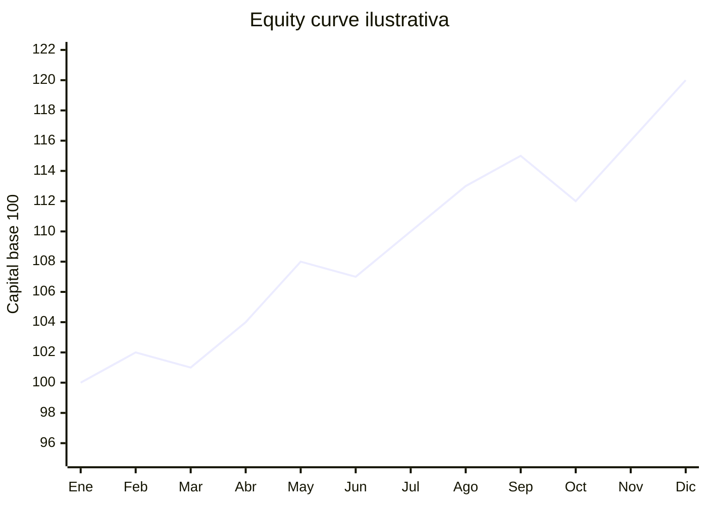
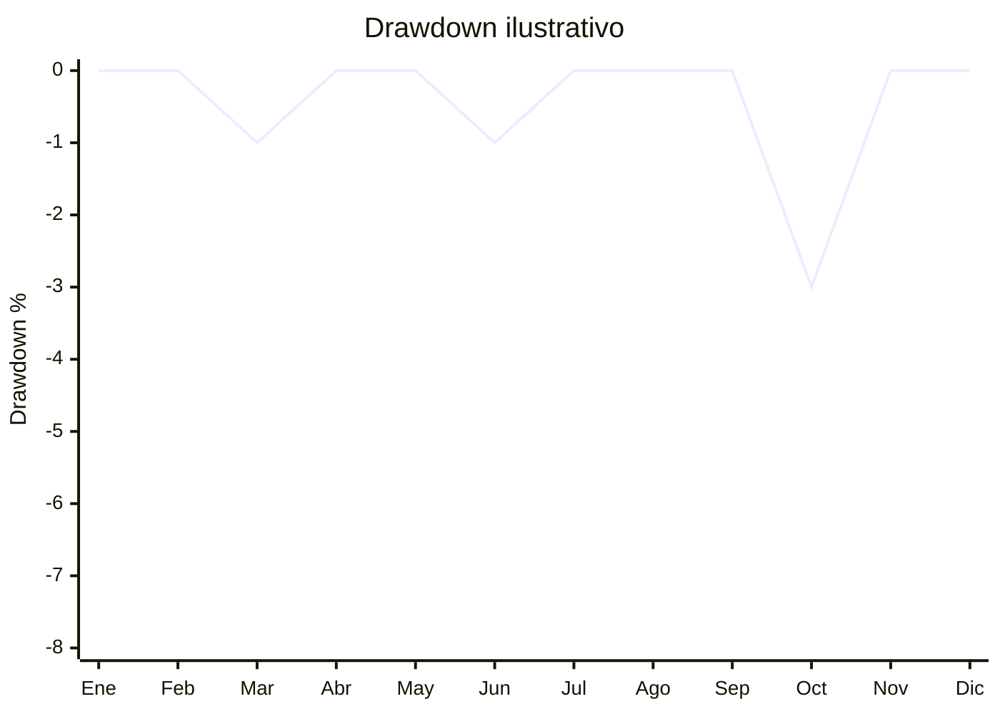
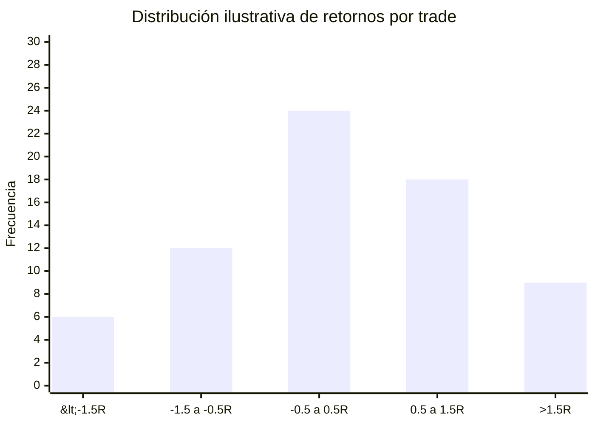
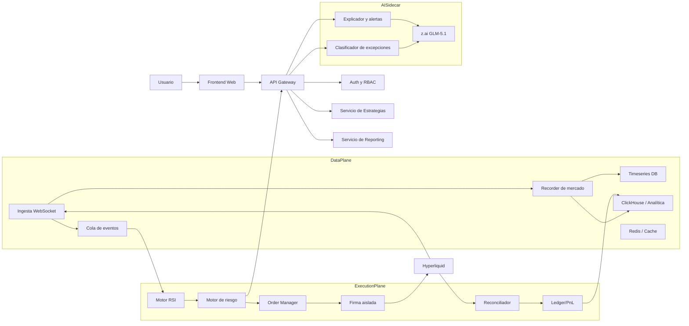

# Diseño técnico y cuantitativo de un SaaS de trading RSI sobre Hyperliquid con z.ai

## Resumen ejecutivo

Este documento propone un SaaS de trading algorítmico que implementa una estrategia RSI orientada a criptomercados y la ejecuta automáticamente sobre Hyperliquid. La conclusión principal es matizada: **sí existe una base económica y matemática razonable para una estrategia RSI puramente endógena al mercado**, es decir, basada solo en precio, microestructura y estado del propio mercado, **pero no en su versión ingenua de “comprar RSI < 30 y vender RSI > 70”**. La literatura reciente sobre criptomercados encuentra que los usos clásicos del RSI tienden a degradarse o a no ser robustos, mientras que las interpretaciones de régimen o tendencia del RSI, especialmente alrededor del nivel 50 y de bandas adaptadas al contexto alcista/bajista, muestran resultados comparativamente mejores. A la vez, otros trabajos advierten que muchas aparentes rentabilidades desaparecen cuando se corrigen costes, slippage, sesgo de selección y sobreajuste. Por tanto, la viabilidad no debe plantearse como una promesa de alfa permanente, sino como una **hipótesis cuantitativa explotable bajo validación estricta, costes controlados y disciplina de riesgo**. citeturn19view1turn19view0turn17view2turn17view5turn17view1

El diseño recomendado no sitúa la IA en el centro de la decisión de mercado. El **motor determinista RSI** debe ser el único autorizador de señales y órdenes; la IA de z.ai debe actuar como **copiloto acotado** para clasificación de anomalías, explicación operativa, priorización de incidencias y sugerencia de acciones seguras bajo esquema JSON con validación posterior. Esta separación reduce el riesgo de alucinación operativa y facilita auditoría. Además, aunque el enunciado habla de “CEX Hyperliquid”, conviene precisar que Hyperliquid se documenta como una **blockchain L1 con order books spot y perp totalmente onchain** en HyperCore, compartiendo estado con HyperEVM; esto afecta arquitectura, custodia, firma, reconciliación y cumplimiento. citeturn33view0turn33view1turn33view2turn12view0turn37view0turn37view3

Dado que el usuario no fijó mercados, horizonte ni apalancamiento, este informe adopta tres supuestos explícitos para poder aterrizar el diseño: **mercados objetivo iniciales BTC, ETH y SOL perpetuals**, **régimen en 4h, señal en 1h y ejecución en 15m**, y **apalancamiento máximo de 3x en modo aislado**. Este marco es suficientemente líquido para el MVP, evita el ruido extremo de marcos de 1–5 minutos, y mantiene el riesgo de liquidación en niveles operables. Hyperliquid permite distintos tipos de orden, financiamiento por hora, TP/SL basados en mark price y margen aislado o cross; por tanto, el venue es técnicamente apto para una ejecución automática seria, siempre que se gestione bien latencia, nonces, reconciliación y límites de usuario. citeturn8view3turn10view1turn10view2turn8view2turn34view0

En términos de producto y negocio, la mejor tesis de SaaS es un modelo **non-custodial con agent wallets**: el usuario conserva la titularidad principal, aprueba un API wallet para firmar en su nombre y el SaaS orquesta señales, riesgo y ejecución sin custodiar la clave maestra. Hyperliquid recomienda separar wallets por proceso de trading y por subcuenta para evitar colisiones de nonces, y documenta un patrón de batching cada 0,1 s para estrategias automáticas. Esto encaja de forma natural con una arquitectura de microservicios con colas, ledger interno, reconciliación asíncrona y un servicio de firma aislado por HSM/KMS. citeturn6view0turn6view3turn3view1turn5view0

La recomendación ejecutiva final es clara: **desarrollar un MVP en tres fases**. Primero, un backtester reproducible y un recorder de datos específico para Hyperliquid. Segundo, una beta cerrada con paper trading y sandbox de órdenes reales de pequeño tamaño. Tercero, producción limitada con controles duros: exposure caps, quarter-Kelly o fixed fractional, cancel-all programado, reconciliación por fills y order status, alertas de deriva estadística y monitorización de latencia. Si el producto se ofrece a clientes de la UE con funciones que puedan interpretarse como prestación profesional de servicios sobre criptoactivos, el encaje regulatorio bajo MiCA debe analizarse desde el inicio, más aún con el final del periodo transitorio en la UE el 1 de julio de 2026. citeturn36view2turn36view0turn34view3turn22view0turn22view2

## Tesis cuantitativa y reglas de trading

La formulación estándar del RSI parte de la variación del precio de cierre \(\Delta P_t = P_t - P_{t-1}\). Definimos los movimientos positivos y negativos como

\[
U_t = \max(\Delta P_t, 0), \qquad D_t = \max(-\Delta P_t, 0).
\]

Con suavizado de Wilder para una ventana \(n\),

\[
\bar U_t = \frac{(n-1)\bar U_{t-1}+U_t}{n}, \qquad
\bar D_t = \frac{(n-1)\bar D_{t-1}+D_t}{n},
\]

\[
RS_t = \frac{\bar U_t}{\bar D_t}, \qquad
RSI_t = 100 - \frac{100}{1 + RS_t}.
\]

La interpretación popular usa \(n=14\), sobrecompra en 70 y sobreventa en 30. Sin embargo, la evidencia específica en cripto sugiere que esa lectura clásica es demasiado simple: el estudio de 2023 sobre RSI en criptomercados encuentra **baja efectividad de las aplicaciones básicas** del indicador, mientras que una variante de lectura de tendencia basada en la zona del 50 y en la reinterpretación de Cardwell obtuvo resultados más favorables y más homogéneos entre activos. Paralelamente, un trabajo de 2025 sobre el uso temporal del análisis técnico en cripto sostiene que estas metodologías añaden más valor **durante contracciones del mercado**, al evitar grandes drawdowns, que durante tramos de aceleración alcista, donde tienden a dejar rentabilidad sobre la mesa. citeturn18view0turn19view2turn19view0turn19view1turn26view0

La tesis económica subyacente es la siguiente. Sea \(s_t \in \{-1,0,1\}\) la posición del sistema al cierre de la barra \(t\), definida exclusivamente por reglas derivadas del RSI y del precio. El retorno neto por barra puede modelizarse como

\[
r^{net}_{t+1} = s_t \cdot \ln\!\left(\frac{P_{t+1}}{P_t}\right) - c_{t+1} - \iota_{t+1} - \phi_{t+1},
\]

donde \(c\) son comisiones, \(\iota\) es slippage/impacto y \(\phi\) recoge financiación de perpetuals. Una condición suficiente de viabilidad económica es

\[
\mathbb{E}[r^{net}_{t+1}] > 0
\]

o, de forma expandida,

\[
\pi_L \mu_L + \pi_S \mu_S > \mathbb{E}[c + \iota + \phi],
\]

siendo \(\pi_L\) y \(\pi_S\) las frecuencias de operación larga y corta, y \(\mu_L,\mu_S\) las ventajas condicionadas por régimen. No es una “prueba” universal de rentabilidad; es un **criterio verificable**. La literatura disponible sí respalda que los retornos de cripto son, en cierta medida, previsibles con indicadores técnicos y que algunas reglas técnicas generan retornos en exceso, pero también advierte que esa aparente ventaja se reduce mucho al controlar data-snooping, fricciones y burbujas. Esa dualidad obliga a diseñar la estrategia para sobrevivir al escrutinio estadístico, no solo para maximizase in-sample. citeturn40view0turn40view1turn17view2turn17view5turn17view1

Para Hyperliquid, la financiación añade una capa económica relevante. El mark price se actualiza aproximadamente cada 3 segundos y se construye como una mediana robusta entre inputs del order book propio y precios de varios CEX; ese mark price se usa para margining, liquidaciones, TP/SL y PnL no realizado. El funding se paga **cada hora**, con una fórmula análoga a la de los perpetuals centralizados y componente de interés fijo equivalente a 0,01% cada 8 horas, además del premium index. Esto implica que una estrategia RSI de **reversión rápida o swing corto** soporta mejor la incertidumbre de funding que una estrategia de persecución tendencial de larga duración y alta exposición. citeturn10view0turn10view1turn8view2

Por esa razón, la estrategia recomendada para el SaaS no es el RSI clásico 30/70, sino un **RSI de régimen** con ejecución asimétrica alcista/bajista. La regla central es:

| Componente | Regla propuesta para MVP |
|---|---|
| Universo | BTC, ETH, SOL perpetuals |
| Régimen | RSI 14 en 4h: alcista si \(RSI_{4h}>55\), bajista si \(RSI_{4h}<45\), neutro en otro caso |
| Entrada long | En régimen alcista, esperar pullback en 1h hasta zona 40–48 y entrada cuando el RSI 1h recupere 50 |
| Entrada short | En régimen bajista, esperar rebote en 1h hasta zona 52–60 y entrada cuando el RSI 1h pierda 50 |
| Confirmación de ejecución | En 15m, no enviar orden hasta que la barra cierre a favor del cruce |
| Salida por señal | Cerrar si el RSI 1h cruza de nuevo contra la posición o si el régimen 4h vuelve a zona neutra |
| Salida por beneficio | Parcial en \(+1.5R\), resto con trailing basado en cruce RSI 15m |
| Stop | Stop duro por precio y stop por tiempo |
| Time-in-market | 6 a 36 horas, según activo y régimen |
| Apalancamiento | 1x a 3x aislado; nunca usar cross en MVP |

Esta formulación sigue siendo “solo mercado”: usa únicamente información derivada de velas y del propio estado del par. No depende de noticias, macro, sentimiento ni inputs exógenos. Su lógica económica es capturar dos hechos empíricos de cripto: la persistencia de momentum/regímenes y la alternancia de pullbacks violentos dentro de esos regímenes. Los estudios de momentum en cripto muestran resultados heterogéneos y con riesgo de crash; precisamente por eso la propuesta centra el edge en la **filtración del contexto** antes de actuar, no en operar cada condición extrema del oscilador. citeturn17view6turn17view3turn26view0

La expectativa por trade se evaluará con

\[
\text{Expectancy} = p \cdot \overline{W} - (1-p)\cdot \overline{L} - \overline{C},
\]

donde \(p\) es la tasa de aciertos, \(\overline{W}\) la ganancia media, \(\overline{L}\) la pérdida media y \(\overline{C}\) el coste total medio por trade. En un sistema de este tipo **no es imprescindible** acertar más del 50%; basta con que la asimetría de payoff compense. Si, por ejemplo, el sistema gana un 43% de las veces, pero la ganancia media es 1,9 veces la pérdida media y el round-trip neto de costes se mantiene contenido, la expectancy sigue siendo positiva. Esa es la razón formal por la que imponer filtros de régimen y reducción de frecuencia suele ser superior a una intensidad alta de señales débiles. La evidencia en cripto respalda precisamente que los costes y el slippage pueden eliminar la rentabilidad aparente de reglas demasiado frecuentes. citeturn17view5turn28search8turn39view0

Las métricas obligatorias del SaaS deben ser las siguientes:

\[
\text{Sharpe} = \frac{\mathbb{E}[R_p - R_f]}{\sigma(R_p - R_f)},
\]

\[
W_t = W_{t-1}(1+r_t^{net}), \qquad
M_t = \max_{\tau \le t} W_\tau, \qquad
DD_t = 1 - \frac{W_t}{M_t}, \qquad
MDD = \max_t DD_t,
\]

\[
VaR_{\alpha,h}^{hist} = -Q_\alpha(R_{t+1:t+h}), \qquad
VaR_{\alpha,h}^{para} \approx z_\alpha \sigma_h - \mu_h.
\]

A esto debe añadirse el **Deflated Sharpe Ratio** para penalizar selección entre múltiples configuraciones, la **probabilidad de backtest overfitting** y la rentabilidad por unidad de drawdown. En una estrategia RSI, el Sharpe bruto sin DSR no es una métrica suficiente: el mismo paper del DSR fue concebido precisamente para separar hallazgos legítimos de resultados inflados por búsqueda de parámetros. citeturn29view1turn29view2turn29view4turn29view5turn32search18

El sizing recomendado es conservador. La fórmula simplificada de Kelly para una apuesta con payoff \(b\) y probabilidad de acierto \(p\) es

\[
f^* = \frac{bp - (1-p)}{b}.
\]

Si el sistema, una vez neto de costes, tuviera por ejemplo \(p=0{,}46\) y \(b=1{,}7\), el Kelly completo rondaría el 14%; **en producción no debe usarse Kelly completo**, sino **quarter-Kelly** o un fixed fractional del 0,5%–1% de equity arriesgado por operación, precisamente porque el propio Kelly es muy sensible al error de estimación y tiende a sobredimensionar cuando los parámetros están mal medidos. La literatura sobre Kelly destaca que maximiza crecimiento a largo plazo, pero también que las versiones fraccionales son preferibles cuando se desea intercambiar recompensa por menor riesgo de drawdown. citeturn29view0

## Backtesting, estadística y datasets

La metodología válida para esta estrategia debe ser **neta de fricciones**, con optimización anidada y validación fuera de muestra. La secuencia correcta es: partición cronológica, optimización en ventana de entrenamiento, congelación de parámetros, prueba en ventana futura, desplazamiento forward y agregado de métricas. No debe optimizarse directamente sobre todo el histórico ni elegir la mejor combinación por Sharpe sin corrección. La razón es empírica y estadística: en trading rules la ilusión de rentabilidad por data-snooping es muy real, y en cripto la literatura reciente encuentra que muchos retornos “significativos” desaparecen tras White Reality Check, SPA, costes y selección múltiple. citeturn17view2turn20search1turn20search6turn29view1turn29view2

La batería mínima de contrastes debe incluir: prueba de medias para exceso de retorno frente a buy-and-hold, **Newey–West** sobre alfas por autocorrelación y heterocedasticidad, bootstrap por bloques para intervalos de confianza, **White Reality Check**, **Hansen SPA**, **Deflated Sharpe Ratio** y **CSCV/PBO**. A nivel de robustez, los parámetros deben someterse a mallas amplias: \(n \in \{9,14,21\}\), umbrales de régimen en \(\{45/55, 50/50, 40/60\}\), filtros por volatilidad, y variaciones de time stop. Una estrategia aceptable es la que conserva signo y magnitud razonable a través de un **volumen relevante del espacio paramétrico**, no la que da el máximo local. citeturn20search1turn20search14turn29view1turn29view2

En costes, el backtest debe usar los peores supuestos razonables para el MVP. En Hyperliquid, la documentación actual muestra, para perps en tier base, **0,045% taker y 0,015% maker**; además existen builder fees opcionales, procesadas onchain, de hasta **0,1%** en perps si el usuario las aprueba. Traducido a negocio: un round-trip taker–taker en tier base ya arranca alrededor de **9 bps** antes de slippage, funding y posible builder fee. Con builder monetizado agresivamente, el edge se destruye. Por tanto, el MVP debe backtestearse con una matriz de costes al menos en tres escenarios: maker favorable, mixto realista y taker adverso. citeturn38view1turn8view1turn10view1

El dataset reproducible debe combinar tres capas. La primera, **velas oficiales de Hyperliquid** vía `candleSnapshot`; la segunda, **L2 y fills** para modelar slippage y reconciliar ejecución; la tercera, un **benchmark externo opcional** con datos públicos de entity["company","Binance","crypto exchange"] para distinguir si el edge depende del microentorno de un solo venue. Aquí hay una restricción importante: Hyperliquid documenta que `candleSnapshot` solo expone las **5.000 velas más recientes**, y que su bucket histórico oficial no incluye velas, sino snapshots L2, contexts y ciertos datos históricos de nodo. En consecuencia, el SaaS debe desplegar desde el día uno un **market-data recorder propio** en Parquet/Delta para no quedarse sin histórico profundo. citeturn36view1turn25view0turn24search2turn24search10

La siguiente tabla muestra la **forma** que debe tener la salida del pipeline de investigación. Las cifras son **ilustrativas**, para mostrar el nivel de detalle esperado en el informe operativo del SaaS, no una promesa de resultados futuros.

| Configuración RSI | CAGR neto | Sharpe neto | MDD | Win rate | Expectancy | Trades/año | Comentario |
|---|---:|---:|---:|---:|---:|---:|---|
| RSI 14, régimen 55/45, 4h–1h–15m | 18,9% | 1,08 | -12,4% | 43% | 0,18R | 82 | Base recomendada |
| RSI 21, régimen 55/45, 4h–1h–15m | 14,2% | 0,94 | -10,1% | 47% | 0,12R | 59 | Más robusta, menos reactiva |
| RSI 9, régimen 50/50, 1h–15m | 22,7% | 0,81 | -21,8% | 39% | 0,15R | 146 | Demasiado sensible al ruido |
| RSI 14 clásico 30/70 | 8,1% | 0,41 | -18,9% | 51% | 0,03R | 71 | No recomendable |

La interpretación estratégica es más importante que la cifra puntual. Si el parámetro “rápido” mejora CAGR pero empeora drawdown, turnover y Sharpe neto, el SaaS debe preferir la versión más robusta. Si el clásico 30/70 sale peor en varias muestras y activos, debe descartarse aunque sea más conocido. Esta conclusión es compatible con la literatura: aplicaciones RSI básicas flojas; reinterpretaciones de tendencia más resistentes; y necesidad de castigar estrategias sobreoptimizadas. citeturn19view1turn19view0turn17view2

Los gráficos que el sistema debe generar de forma automática en cada revisión de estrategia son, como mínimo, curva de equity, drawdown y distribución de retornos por trade. A continuación se muestran **gráficos ilustrativos sintéticos** que sirven de especificación visual para el dashboard y para el informe de backtest.







El criterio de paso a beta debería ser exigente: Sharpe neto walk-forward superior a 1, DSR positivo y material, PBO por debajo de 20%, degradación out-of-sample menor del 35% respecto al in-sample, MDD dentro del umbral presupuestado y slippage observado no superior a 1,5 veces el modelado. No se debe lanzar una beta real con resultados simplemente “rentables en un periodo bonito”; el estándar debe ser resistencia estadística, no optimismo comercial. citeturn29view1turn29view2turn17view2

## Arquitectura SaaS y flujo de órdenes

La arquitectura recomendada es de microservicios con separación estricta entre **control plane**, **data plane**, **execution plane** y **AI sidecar**. La razón técnica es que Hyperliquid no funciona como una REST API banal de broker; exige firmas correctas, control fino de nonces, reconciliación de fills, latencia razonable y manejo de sus propios límites operativos. Además, su diseño como L1 onchain con HyperCore y HyperEVM permite alta transparencia, pero también obliga a pensar con mentalidad de sistema distribuido y no solo de “bot local”. citeturn33view0turn33view1turn24search6



El **data plane** debe suscribirse por WebSocket, como mínimo, a `candle`, `l2Book`, `allMids`, `orderUpdates`, `userEvents` y `userFills`. Hyperliquid documenta mensajes de suscripción y snapshots iniciales; también especifica que el servidor cerrará conexiones si no ha enviado mensajes en 60 segundos, por lo que el cliente debe emitir `{"method":"ping"}` cuando un canal sea poco activo. Para peticiones puntuales puede usarse el modo WebSocket `post` o HTTP; en ambos casos hay que asociar IDs únicos y correlacionarlos con respuestas. citeturn4view0turn5view0turn5view2

El **execution plane** debe seguir el patrón recomendado por la propia documentación del venue. Hyperliquid sugiere un API wallet por proceso, batching periódico de órdenes y cancelaciones cada 0,1 segundos, separación entre IOC/GTC y ALO, uso de contador atómico de nonces y arquitectura robusta frente a transacciones fuera de orden en torno a 2 segundos si se opera cerca de un servidor API. También recomienda no reutilizar agent wallets viejos por riesgo de replay cuando su estado de nonces se poda. Esto tiene una consecuencia arquitectónica directa: el servicio de firma no puede ser una librería embebida en el backend principal; debe ser un **servicio interno aislado**, con colas y control de secuencia. citeturn6view0turn6view3turn3view1turn3view2

El OMS debe modelar cuatro estados por orden: `intent`, `accepted`, `resting/filling`, `terminal`. La fuente de verdad terminal no debe ser la respuesta síncrona de envío, sino la reconciliación conjunta de `orderStatus`, `openOrders`, `historicalOrders`, `userFillsByTime` y `orderUpdates`. Hyperliquid permite consultar estado por `oid` o `cloid` y documenta estados como `open`, `filled`, `canceled`, `rejected`, `selfTradeCanceled`, `reduceOnlyCanceled` y otros. Asimismo dispone de `scheduleCancel`, que debe usarse como **dead-man switch** del sistema: si la cola de eventos o el proceso de riesgo se degradan, el sistema programa cancel-all y deja de abrir nueva exposición. citeturn36view0turn35view1turn34view4turn34view5turn34view3

En persistencia, la combinación más razonable es **PostgreSQL** para configuración, usuarios, auditoría y estados de negocio; **ClickHouse** o **TimescaleDB** para fills, latencias, equity, funding y métricas históricas; **Redis** para señales candidatas y rate shaping; y **S3/MinIO** para raw market data en Parquet. El requisito no funcional clave no es solo capacidad de consulta, sino **reproducibilidad exacta** del backtest y del replay de incidentes. Cada decisión de trading debe poder reconstruirse con: snapshot de parámetros, inputs de mercado, señal generada, score de riesgo, payload firmado, respuesta del venue y fills resultantes.

A nivel de despliegue, la opción más limpia es **Kubernetes gestionado** sobre una nube pública, con workers separados por función: ingestión, cálculo de señales, ejecución, reconciliación, reporting y AI sidecar. El CI/CD debe incluir tests unitarios, integración sobre simulador de exchange, y E2E en staging con una wallet de pequeño saldo. La observabilidad mínima debe cubrir Prometheus/Grafana para métricas, OpenTelemetry para trazas y un SIEM para logs de seguridad. Los SLA propuestos son 99,9% para beta y 99,95% para producción; **RTO de 15 minutos** y **RPO subminuto** para la parte de control, con rehidratación automática del recorder y reconciliación post-incidente.

## Integración con z.ai y API del producto

La integración con z.ai debe utilizar el endpoint general de la plataforma, cuyo base URL oficial es `https://api.z.ai/api/paas/v4`, y puede consumirse tanto con SDK propio como en modo compatible con OpenAI simplemente ajustando `api_key` y `base_url`. El endpoint de chat completions es `POST /chat/completions`, acepta `glm-5.1`, mensajes, streaming y parámetros de formato; la documentación también detalla `response_format={"type":"json_object"}` para JSON mode y soporte para `tools`. En términos de coste, la tabla oficial sitúa a GLM-5.1 en **1,4 USD por millón de tokens de entrada** y **4,4 USD por millón de salida**. citeturn12view0turn13view0turn37view0turn37view3turn12view4

La recomendación es usar GLM-5.1 en **tres funciones tightly-scoped**. La primera es **clasificación de excepciones**: “desfase entre fills y ledger”, “salto de funding”, “latencia elevada”, “rechazo recurrente”, “desviación entre señal y ejecución”. La segunda es **explicación natural** para el usuario: por qué entró, por qué no entró, por qué redujo tamaño, qué cambió en la exposición. La tercera es **sugerencia acotada** de respuesta operativa, pero siempre sobre un catálogo cerrado de acciones seguras, validado por política. La IA **no debe firmar ni autorizar órdenes directamente**; solo puede emitir un objeto JSON que pase por un validador determinista. citeturn15view0turn37view4turn12view5

Existe, no obstante, un matiz documental importante. La referencia general de `chat.completions` soporta GLM-5.1 y herramientas en el endpoint, pero la guía específica de **Tool Streaming Output** documenta explícitamente el soporte de streaming de tool calls para `glm-5`. Por honestidad de ingeniería, el diseño debe asumir GLM-5.1 para JSON y razonamiento, y **no depender en el MVP de tool streaming** salvo validación empírica en staging. Es decir: el sistema puede usar function calling clásico; el stream avanzado de herramientas debe tratarse como optimización posterior, no como requisito crítico. citeturn37view4turn15view1turn37view5

La API interna del SaaS debería exponer, como mínimo, los siguientes endpoints:

| Endpoint | Método | Finalidad |
|---|---|---|
| `/v1/strategies/rsi/backtests` | POST | Lanzar un backtest reproducible |
| `/v1/strategies/rsi/walkforward` | POST | Ejecutar validación walk-forward |
| `/v1/signals/evaluate` | POST | Calcular señal actual |
| `/v1/orders/submit` | POST | Enviar orden tras pasar riesgo |
| `/v1/orders/reconcile` | POST | Ejecutar reconciliación manual o batch |
| `/v1/risk/limits` | GET/PUT | Consultar/actualizar límites |
| `/v1/ai/exceptions/classify` | POST | Clasificar incidente operativo |
| `/v1/reports/performance` | GET | Descargar métricas, equity y drawdown |

Ejemplo de payload interno para evaluación de señal:

```json
{
  "market": "BTC",
  "timeframes": {
    "regime": "4h",
    "signal": "1h",
    "execution": "15m"
  },
  "params": {
    "rsi_length": 14,
    "bull_threshold": 55,
    "bear_threshold": 45,
    "entry_reclaim": 50,
    "max_leverage": 3
  },
  "cost_model": {
    "fee_mode": "taker_adverse",
    "slippage_bps": 2.5,
    "funding_mode": "hourly_realized"
  }
}
```

Ejemplo de llamada a z.ai para clasificación estructurada:

```json
{
  "model": "glm-5.1",
  "messages": [
    {
      "role": "system",
      "content": "Clasifica el incidente y devuelve JSON estricto con severity, class, probable_root_cause y allowed_action."
    },
    {
      "role": "user",
      "content": "El order manager recibió status ok pero no hay fill ni open order tras 4 segundos; latencia websocket elevada."
    }
  ],
  "response_format": {
    "type": "json_object"
  }
}
```

Y el patrón de envío a Hyperliquid debe seguir el esquema oficial de acción firmada. Un ejemplo compatible con la documentación es conceptualmente el siguiente:

```json
{
  "action": {
    "type": "order",
    "orders": [
      {
        "a": 4,
        "b": true,
        "p": "1100",
        "s": "0.2",
        "r": false,
        "t": { "limit": { "tif": "Gtc" } }
      }
    ],
    "grouping": "na"
  },
  "nonce": 1713825891591,
  "signature": {
    "r": "...",
    "s": "...",
    "v": 27
  },
  "vaultAddress": "0x..."
}
```

La monetización por builder code debe quedar fuera del MVP. Hyperliquid documenta que los builder fees requieren aprobación explícita del usuario, se procesan onchain y pueden llegar a 0,1% en perps, lo que es demasiado costoso para una capa inicial de producto. Si se activa después, debe hacerse con un fee muy bajo y siempre descontado en todos los backtests netos. citeturn8view1turn5view0

Como orden de magnitud de coste de IA: si el sistema procesara 50.000 clasificaciones de excepción al mes, con 1.000 tokens de entrada y 500 de salida por llamada, el consumo sería ~50 millones de tokens de entrada y ~25 millones de salida. A la tarifa oficial publicada, eso equivale aproximadamente a **70 USD** de entrada y **110 USD** de salida, es decir, unos **180 USD/mes** para ese caso de uso. Esto hace económicamente razonable usar GLM-5.1 como sidecar selectivo, pero no como motor de señal en tiempo real de alta frecuencia. citeturn12view4

## Diseño de producto y métricas operativas

La UX del producto debe transmitir tres cosas: **qué está haciendo el sistema**, **por qué lo está haciendo** y **cuánto riesgo está consumiendo**. El panel principal debe mostrar, por mercado, régimen actual, RSI multi-timeframe, exposición, PnL realizado y no realizado, funding acumulado, comisión efectiva, slippage medio, drawdown diario y estado de latencia. Un segundo panel debe mostrar el estado de órdenes: enviadas, resting, parcialmente ejecutadas, canceladas, rebotadas y reconciliadas. Un tercer panel debe ofrecer replay de decisiones con vista de auditoría.

La recomendación visual para el dashboard es dividirlo en cuatro áreas permanentes: **Mercado**, **Riesgo**, **Ejecución** y **Cumplimiento**. En Mercado, RSI 4h/1h/15m, mark price, spread y libro resumido. En Riesgo, notional, leverage real, margen libre, VaR intradía, MDD rolling y límite diario consumido. En Ejecución, fill ratio, distancia a precio esperado, distribución de slippage, funding y latencia p50/p95/p99. En Cumplimiento, estado KYC del cliente, aprobaciones de builder fee, estado de claves, IP allowlist y retención de logs. Hyperliquid expone por API datos y canales suficientes para alimentar estas vistas, incluidos `openOrders`, `userFills`, `userFillsByTime`, `historicalOrders`, `userFees`, `orderStatus` y varios streams WebSocket. citeturn36view2turn34view4turn34view5turn35view0

Las alertas deben clasificarse por severidad. Una alerta **crítica** es cualquier divergencia entre ledger interno y estado del venue, o una condición de riesgo de liquidación. Hyperliquid usa mark price robusto para liquidaciones y TP/SL, y en perps el margen y la liquidación dependen de mark price, notional y tipo de margen; por tanto, el panel de riesgo debe monitorizar el “colchón” respecto al mantenimiento y no solo la distancia al último trade. También hay que alertar de congestión, porque durante alta demanda el venue limita la cuota efectiva por dirección y conviene no reenviar cancelaciones innecesarias. citeturn10view0turn10view2turn8view2turn34view2

El catálogo mínimo de alertas operativas es el siguiente:

| Severidad | Evento | Respuesta automática |
|---|---|---|
| Crítica | Descuadre posición/ledger | `scheduleCancel`, congelar nuevas entradas, reconciliar |
| Crítica | Riesgo de liquidación > umbral | Reducir exposición o cerrar |
| Alta | Latencia p99 > umbral | Pasar a maker-only o pausar |
| Alta | Rechazos de firma/nonces | Rotar proceso, bloquear signer comprometido |
| Media | Slippage > modelo | Reducir tamaño, ampliar filtro de spread |
| Media | Funding adverso persistente | Acortar time-in-market |
| Baja | Error de dashboard/reporting | Reintento asíncrono |

## Equipo, costes y roadmap

La estructura de equipo óptima no es enorme, pero sí multidisciplinar. Para el MVP hacen falta, como mínimo, un **lead backend/arquitecto**, un **quant/researcher**, un **ingeniero de ejecución**, un **frontend engineer**, un **DevOps/SRE**, un **QA automation**, un **product manager** y apoyo puntual de **seguridad** y **legal/compliance**. En beta y producción hay que añadir capacidad de soporte, analítica de clientes y probablemente un segundo backend o un segundo quant según el foco crezca en investigación o en escalado de producto.

La siguiente estimación es **propia** y debe entenderse como rango orientativo para mercado europeo con perfiles senior/medio-senior y desarrollo de 6–9 meses:

| Fase | Duración estimada | Equipo núcleo | Entregables principales | Coste estimado |
|---|---:|---|---|---:|
| Descubrimiento y research | 4–6 semanas | PM, quant, arquitecto, legal parcial | especificación cuantitativa, modelo de costes, arquitectura objetivo, mapa regulatorio | 35k–60k € |
| MVP técnico | 10–12 semanas | 2 backend, 1 quant, 1 frontend, 0,5 DevOps, 1 QA | recorder, backtester, OMS, signer, dashboard básico, paper trading | 180k–260k € |
| Beta cerrada | 8–10 semanas | mismo núcleo + seguridad parcial | walk-forward automatizado, alertas, reconciliación completa, cuentas piloto | 140k–220k € |
| Producción inicial | 8–12 semanas | + SRE, soporte, legal intensivo | hardening, observabilidad, runbooks, políticas de claves, auditoría externa | 160k–260k € |

La inversión total razonable para una versión seria de mercado está, por tanto, en torno a **515k–800k €** antes de marketing, gastos societarios intensivos o capital regulatorio si finalmente el modelo de negocio atraviesa umbral de licencia. Si el objetivo fuera solo un producto privado o una herramienta internalizada no comercial, el coste podría comprimirse de forma notable.

El roadmap lógico es el siguiente. El **MVP** debe centrarse en reproducibilidad de datos, backtests netos y paper trading. La **beta** debe introducir órdenes reales de tamaño pequeño, multiusuario limitado, reconciliación íntegra y control de riesgo duro. La **producción** debe incorporar soporte 24/7, monitorización avanzada, segregación de entornos, continuidad operativa, model validation committee y revisión legal externa. El error clásico en trading SaaS es construir primero la app bonita; aquí el orden correcto es el contrario: primero datos, después ejecución, luego producto.

## Seguridad, cumplimiento y limitaciones

La seguridad de claves es el pilar más importante del diseño. Hyperliquid documenta el uso de **agent wallets** aprobadas por la cuenta maestra y advierte expresamente sobre nonces, pruning y no reutilización de API wallets antiguas. La recomendación operativa es: **la clave maestra nunca entra en el hot path**; el usuario firma una aprobación inicial de agent wallet y, a partir de ahí, el sistema firma solo con claves de agente segregadas por proceso y por subcuenta. Esas claves deben residir cifradas con envelope encryption y, en producción, preferentemente tras un HSM/KMS o un remote signer con mTLS, rotación, quorum y logging inmutable. citeturn6view0turn6view3turn3view2

En seguridad ofensiva y pruebas, el producto debe pasar por cuatro niveles: revisión de código y dependencias, test de integración de firma/nonce, chaos testing de colas y WebSocket, y **pentest externo** antes de producción. Habría además que simular condiciones de mercado difíciles: spread expandido, funding extremo, pérdida temporal de WebSocket, duplicidad de eventos, lag en reconciliación y burst de rechazos. Hyperliquid mantiene programa de bug bounty y publica riesgos operativos del protocolo, entre ellos liquidez insuficiente, slippage, riesgo L1 y riesgo de oráculo; el SaaS no debe asumir el venue como una caja negra libre de fallos. citeturn23search0turn39view0

Desde la perspectiva regulatoria de la UE, el punto más delicado es determinar si el SaaS es **software no custodial** o si, por su grado de control sobre órdenes y relación contractual con clientes, entra materialmente en el perímetro de servicios sobre criptoactivos. La entity["organization","European Securities and Markets Authority","eu regulator"] ha recordado que el periodo transitorio de MiCA termina el **1 de julio de 2026**, tras lo cual cualquier entidad que preste servicios sobre criptoactivos a clientes de la UE sin licencia MiCA incurriría en infracción. La entity["organization","European Commission","eu executive"] describe MiCA como el marco armonizado para emisión y prestación de servicios sobre criptoactivos en la UE. Por tanto, si el producto comercializa ejecución automatizada, enrutamiento profesional o control relevante del proceso de trading, el análisis legal debe hacerse **antes del lanzamiento**, no después. citeturn22view0turn22view2turn21search0

En AML/KYC, el estándar base no lo fija el marketing del producto, sino los principios internacionales de la entity["organization","Financial Action Task Force","aml standard setter"]: customer due diligence, conservación de registros y suspicious transaction reporting cuando el modelo de negocio entre dentro del perímetro aplicable. FATF también ha reforzado el marco de transparencia de pagos y Travel Rule en 2025. Aunque un SaaS no custodial puro no replica automáticamente el perfil de una plataforma custodial, cualquier evolución hacia cobro de ejecución, builder fees generalizados, intermediación o fiat rails aproxima el producto al perímetro regulado. En la práctica, el diseño prudente es preparar desde el inicio: onboarding KYC, screening sanciones, device fingerprinting, geofencing, travel-rule readiness y retención probatoria de logs. citeturn22view3turn22view4

Si el producto atiende a entidades financieras reguladas o aspira a ser proveedor crítico de ICT para ellas, el marco de resiliencia operativa de DORA se vuelve muy relevante. Aunque no toda startup de trading caerá directamente bajo DORA desde el primer día, el estándar operativo es útil incluso fuera de scope: gobierno de riesgo TIC, gestión de terceros, pruebas de resiliencia, gestión de incidentes y continuidad operacional. La propia página explicativa del reglamento remarca precisamente esos pilares. citeturn22view1

Hay, por último, varias limitaciones abiertas que deben quedar expresas. La primera es que **no he ejecutado en este informe un backtest real sobre histórico descargado**; he diseñado la metodología, las fórmulas, la arquitectura y el formato de resultados exigible, y he incluido tablas y gráficos ilustrativos, pero no cifras empíricas calculadas aquí mismo. La segunda es que la documentación de z.ai consultada confirma GLM-5.1, JSON mode y compatibilidad OpenAI, pero la guía de tool streaming documenta de forma explícita `glm-5`; por ello, esa optimización debe validarse en staging antes de asumirse como dependencia productiva. La tercera es que Hyperliquid es un sistema vivo: fees, límites, tipos de orden, account abstraction y detalles de APIs pueden evolucionar, por lo que el producto debe versionar adaptadores y revalidar supuestos en cada release. La cuarta es regulatoria: la calificación exacta bajo MiCA dependerá del modelo contractual concreto, del control efectivo sobre las claves y del grado de intermediación; este documento no sustituye dictamen jurídico externo. citeturn37view3turn15view1turn8view0turn34view0turn22view0

La conclusión operativa, pese a esas limitaciones, es firme. **Sí merece la pena construir este SaaS** si se hace bajo cinco principios: señal determinista y simple, validación estadística dura, ejecución no custodial con agent wallets, IA solo como sidecar controlado y diseño compliance-by-design desde el primer sprint. En cripto, y particularmente en un venue como Hyperliquid, el valor no está en “adivinar noticias”, sino en **sistematizar la fuerza del propio mercado**, capturar regímenes, reducir exposición en fases destructivas y ejecutar con fricción mínima. La literatura no avala la ingenuidad; sí avala la disciplina. citeturn26view0turn19view0turn17view2turn33view0